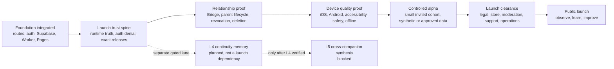

# Se'kret Bip — Visual Launch Roadmap

**Last reviewed:** 2026-07-16  
**Repository baseline:** `ab5cf40b398e02536764b5b806b6f3aec0a9161c`  
**Owner issue:** [#456](https://github.com/jussray/Sekret-Bip/issues/456)

This is the canonical founder-readable map from the current repository state to launch. It describes **sequence and evidence**, not unsupported calendar promises.

`implementation-ledger.json` remains the machine-checked feature-state source. `SPRINT.md` owns the current execution window. `docs/CURRENT_STATUS.md` summarizes what exists now.

## The launch path

## Status legend

| State | Meaning |
|---|---|
| **Integrated** | Code or contract is on `main`; this does not prove production behavior. |
| **Evidence in progress** | The runtime exists, but required production, device, denial, or journey proof is incomplete. |
| **Blocked** | Work may not advance until the named dependency or safety boundary is satisfied. |
| **Planned** | Direction is documented; no implementation claim is made. |

## Phase 0 — Foundation integrated

**Outcome:** one shippable technical spine exists.

- Teen and parent route groups are present.
- Supabase Auth, Postgres, RLS, Storage, migrations, and Edge Functions are integrated.
- The canonical Cloudflare Worker and Pages release path exist.
- Frontend-to-Worker contracts, stable failures, trace IDs, and release verification exist.
- Core teen spaces, companions, Pages, Calm tools, Circle surfaces, and relationship contracts exist at varying evidence levels.

**Truth boundary:** Phase 0 means the foundation is integrated. It does not mean every product journey is released or safe for public teen data.

## Phase 1 — Launch trust spine

**Current phase.**

**Goal:** make every important launch claim observable, deniable, and reversible.

Launch-critical outcomes:

1. Complete focused anonymous and cross-user denial proof for remaining private surfaces.
2. Complete positive and negative behavior tests for high-blast-radius authenticated database functions.
3. Keep custom-auth Edge Functions fail-closed and metadata-only where applicable.
4. Verify each production-changing merge through the exact Worker check, `release.json`, backend health, and production Playwright.
5. Preserve rollback evidence and avoid using stale dashboards or retired probes as release truth.

**Exit evidence:** security contracts pass, production SHA matches the tested merge, and unresolved failures have an explicit owner and rollback.

## Phase 2 — Relationship and privacy lifecycle proof

**Goal:** prove the full teen-parent trust model without exposing raw private content.

Required journeys:

- teen and parent create permanent verified accounts;
- intended two-party relationship linking succeeds;
- private teen source content remains teen-only;
- teen previews and confirms a Bridge share;
- parent receives only the approved generated summary;
- revocation removes access immediately;
- re-share does not resurrect stale access;
- unlink and account deletion remove relationship access;
- a second user remains isolated throughout;
- deletion covers database rows, Storage objects, local caches, retries, and durable receipts.

**Exit evidence:** controlled two-account production proof with cleanup, denial, revocation, and deletion receipts.

## Phase 3 — Device quality, accessibility, and safety

**Goal:** prove the app behaves like a real mobile product, not only a web build.

Required evidence:

- physical iOS and Android smoke journeys;
- signup, login, onboarding, Room, Pages, Calm, Circle, More, and parent-link navigation;
- keyboard, screen-reader, contrast, motion, and touch-target review;
- offline, timeout, rate-limit, malformed-response, and unavailable-voice states;
- timer and movement-safety QA for Mind + Body Reset;
- notification content remains minimal and privacy-safe;
- no raw teen content enters logs, release evidence, or Control Room panels.

**Exit evidence:** device runbook completed with reproducible failures converted into owned issues.

## Phase 4 — Controlled alpha

**Goal:** learn from a deliberately small cohort before broad exposure.

Alpha rules:

- invite-only cohort and explicit support channel;
- synthetic, founder-approved, or appropriately consented data only;
- rollout controls for high-risk capabilities;
- metadata-only product health metrics;
- clear unavailable and unfinished states;
- fast rollback for Worker, Pages, database, and feature-control changes;
- no claim that Se'kret Bip diagnoses, treats, or replaces emergency support.

Founder decisions required before entry:

- alpha cohort and account model;
- free versus paid boundary, if monetization is tested;
- support response expectations;
- which unfinished features are hidden, controlled, or explicitly labeled;
- success and stop conditions.

## Phase 5 — Launch clearance

**Goal:** satisfy the non-code work that determines whether launch is responsible and supportable.

Required gates:

- privacy policy, terms, consent, deletion, and data-retention alignment;
- safeguarding, moderation, escalation, and crisis-resource review;
- app-store metadata, screenshots, age rating, permissions, and review notes;
- accessibility and device evidence;
- production monitoring, incident response, backup, restore, and rollback runbooks;
- support ownership and escalation path;
- launch messaging that matches verified product behavior;
- pricing, entitlements, and purchase restoration evidence if paid features ship.

**Exit evidence:** every applicable item in `docs/legal/LAUNCH_COMPLIANCE_CHECKLIST.md` has an owner, proof, and an honest state.

## Phase 6 — Public launch and learning loop

**Goal:** ship carefully, observe reality, and improve without expanding privacy collection by default.

First-loop priorities:

- activation and retained-use signals that do not require private content;
- crash, latency, failure, and unavailable-state monitoring;
- support themes and consented feedback;
- Bridge and relationship safety observations;
- rollback thresholds;
- weekly founder review of what to keep, fix, pause, or remove.

## Workstream map

| Workstream | Current state | Launch critical? | Next proof |
|---|---|---:|---|
| Release truth and runtime contracts | Integrated; evidence continues per merge | Yes | Exact deployed SHA, Worker health, production Playwright |
| Supabase authorization | Contract with several passed slices | Yes | Remaining private-surface denial and RPC behavior suites |
| Teen Room and companion experience | Integrated | Yes | Physical-device, accessibility, offline, and failure-state QA |
| Daily intentions | Integrated, privacy-scoped | No | Exact production observation and device layout QA |
| Bridge and parent lifecycle | Integrated, controlled | Yes | Complete two-account production journey and revocation proof |
| Account deletion | Integrated, release-blocking proof incomplete | Yes | Database, Storage, local cache, retry, and isolation receipts |
| Mind + Body Reset | Integrated, internal | Conditional | Physical-device timer, accessibility, and movement-safety QA |
| Circle and trusted relationships | Mixed integrated surfaces | Yes if included at launch | Moderation, anonymity, relationship, and notification proof |
| Legal, safeguarding, accessibility, store readiness | In progress | Yes | Named owners and evidence for every applicable gate |
| L4 continuity memory | Planned | No | Smallest safe schema and one consumer only after auth gates |
| L5 synthesis | Blocked | No | L4 must reach `verified`; separate consent contract required |

## Scope rules

- Launch is not blocked on L4 or L5 unless the founder explicitly changes launch scope.
- A feature can remain preserved in the repository while hidden or controlled for launch.
- A green PR proves reviewed integration, not production behavior.
- A successful deployment proves an artifact moved, not that the full user journey is safe.
- Raw teen journals, private messages, voice transcripts, safety evidence, and user identifiers never belong in roadmap evidence.
- Dates may be added only when capacity, dependency, and evidence owners are known.

## How this roadmap changes

A roadmap change must update:

1. this file when phase sequence, scope, or launch gates change;
2. `SPRINT.md` when current execution changes;
3. `docs/CURRENT_STATUS.md` when verified current state changes;
4. `implementation-ledger.json` or a validated ledger extension when implementation claims change;
5. the relevant issue, test, production witness, and rollback evidence.

Research and founder ideas live in `docs/strategy/` or `docs/industry-signals/` until explicitly promoted. They do not silently become launch commitments.
